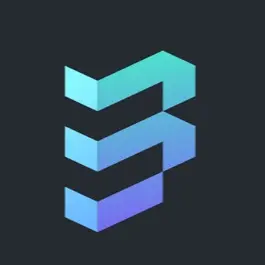

<div align="center">
  <a href="https://github.com/meta-ps/ThirdFund/">
    
  </a>

  <h2 align="center">ThirdFund</h2>

  <p align="center">
    ThirdFund is a decentralized funding platform designed to support projects built on the Mantle Network.
    <br />
    <a href="https://www.loom.com/share/b08e6c3adf284c2ab9e904dc2bc43317">Watch Video</a>

  </p>
</div>

<!-- TABLE OF CONTENT -->
<details>
  <summary>Table of Contents</summary>
  <ol>
    <li>
      <a href="#about-the-project">About The Project</a>
      <ul>
        <li><a href="#built-with">Built With</a></li>
      </ul>
    </li>
    <li>
      <a href="#getting-started">Getting Started</a>
      <ul>
        <li><a href="#prerequisites">Prerequisites</a></li>
        <li><a href="#installation">Installation</a></li>
      </ul>
    </li>
  </ol>
</details>

<!-- ABOUT THE PROJECT -->

## About The Project


ThirdFund is an app for users to launch crowdfunding campaigns for their projects, and backers could make contributions in the form of Mantle($BIT Tokens). 
This entire ThirdFund Platform is built on Mantle Network to support and fundraise for projects on Mantle. ThirdFund uses BIT tokens as payment, smart contract deployed on Mantle Testnet which includes all the details of project 


### Built With

Technologies used for this project are:

- [Mantle](https://www.mantle.xyz/)
- [Next.js](https://nextjs.org/)
- [React.js](https://reactjs.org/)
- [TailwindCSS.js](https://tailwindcss.com/)
- [Solidity.js](https://docs.soliditylang.org/)
- [Typescript.js](https://www.typescriptlang.org/)
- [Hardhat](https://hardhat.org/)


<!-- GETTING STARTED -->

## Getting Started

The project consist of the backend and also the front end.

### Prerequisites

- nodejs installed

- npm
  ```sh
  npm install npm@latest -g
  ```

### Local setup

To run this project locally, follow these steps.

1. Clone the project locally, change into the directory, and install the dependencies:

```sh
git clone https://github.com/meta-ps/ThirdFund.git
cd thirdfund-app
# install using NPM or Yarn
npm install
# or
yarn
```

2. Start the local Hardhat node

```sh
npx hardhat node
```

3. With the network running, deploy the contracts to the local network in a separate terminal window

```sh
npx hardhat run scripts/deploy.js --network localhost
```

4. Start the app

```
npm run dev
```

### Configuration

Used the below article to learn about Mantle testnet and configuring it to metamask.

https://mirror.xyz/0xmantle.eth/CKxRFGZJ6XalmpwuHqwe-S8canXJahQek562QapmNIA


<!-- LICENSE -->

## License

Distributed under the MIT License.


# ThirdFund
